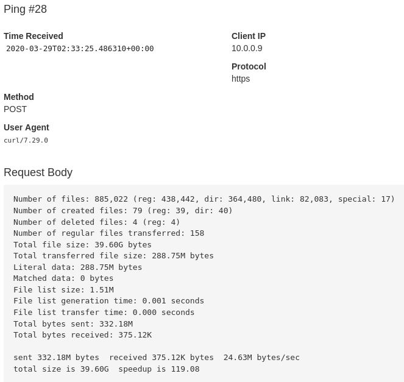

# rsync-healthchecks

Ping Healthchecks after running rsync.  
To measuring the rsync duration add the parameter `--send-start`.  
To send rsync output to Healthcheck as log add the parameter `--send-log`.  
A good parameter for rsync output to send to Healthchecks is `--stats`.  

*All other parameter will be passed to rsync, so be carefull!*

## usage

```bash
Usage: rh.sh [--url] [--send-start] [--log] [--source] [--destination] | [--help] | [--version]

Parameters:
--url                Healthchecks url
--send-start         notify Healthchecks when rsync starts
--send-log           notify Healthchecks when rsync starts
                     send rsync output as log to Healthchecks
                     (max 1000 characters)
--log                path to log file for script output
                     (not rsync log)
--source             path to source for rsync
--destination        path to destination for rsync

All other parameter will be passed to rsync!

Optional Parameters
--help         display this help and exit
--version      output version information and exit

created by gi8lino (2020)
```

## Healthchecks log

If you use the rsync parameter `--stats` this script can send the ouput to Healthchecks.  

Example:  
